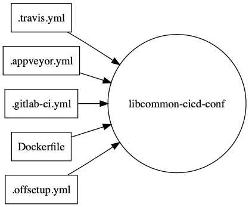
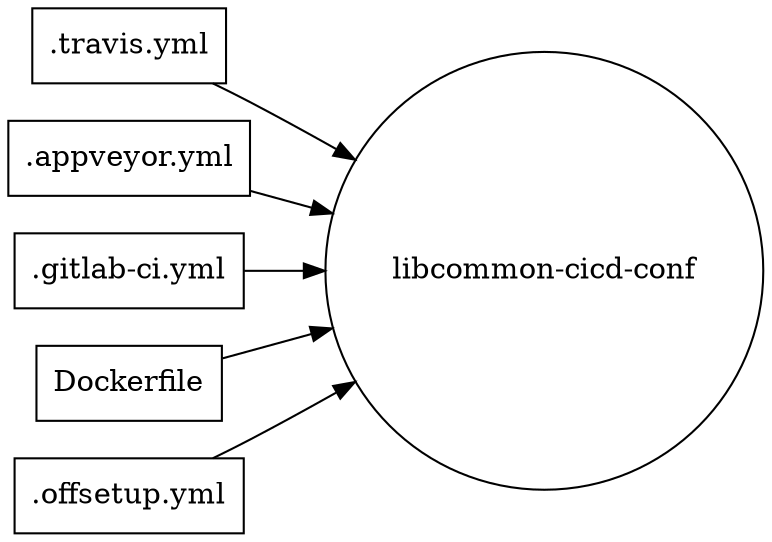

[offcicd] Concepts
==================

## Problem

There are many CI/CD solutions on the market, basically none are open-source.

Additionally, each define their own format, usually in YAML, that specifies the tasks, their dependencies, and how they should run. Also lifecycles (pre_start, after_task, &etc.).

## Solution

Develop parsers to take any of the popular formats—e.g.: Travis CI, Circle CI, Gitlab—and read it into a common `struct`.

Write CI/CD platform that works with that `struct`, and executes those tasks in the chosen environment (Windows, Mac, Docker, Docker Compose, Kubernetes, native Linux).

## Implementation details

Thinking to implement it in Rust with serde. Something like:

<!--

-->

Needs to be able to go to—and from—each format. Validating each config against the rules of the standard implementation would be a nice-to-have.
